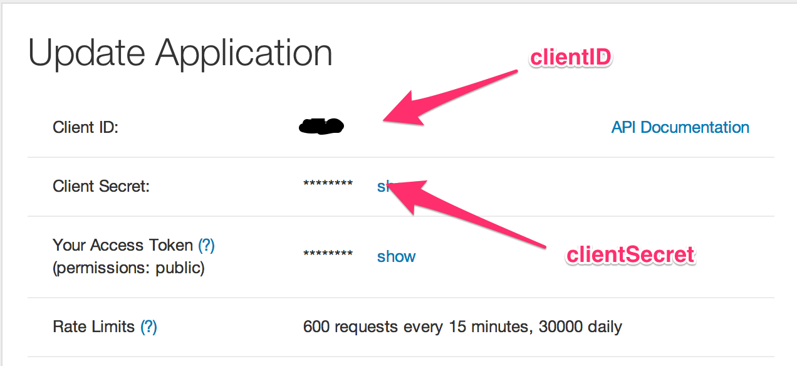
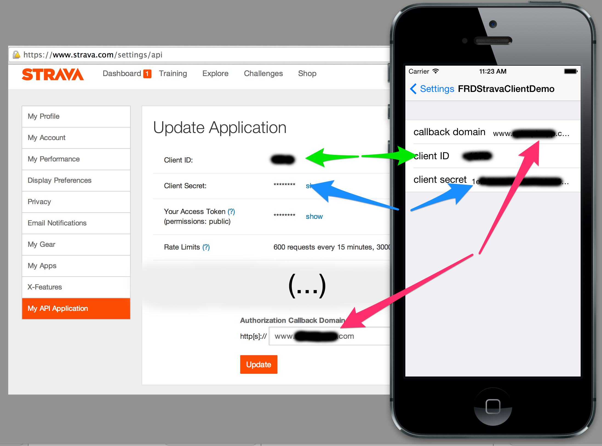
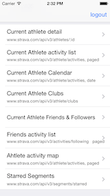
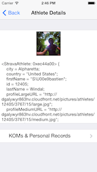
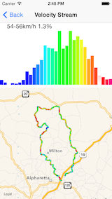
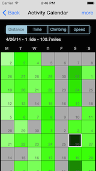
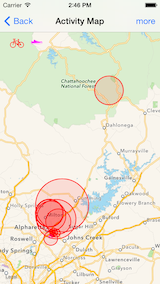
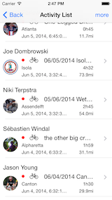
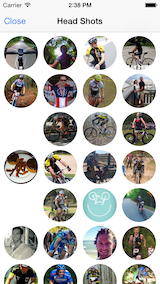
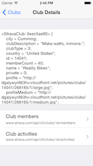

# FRDStravaClient

## The library

### overview

FRDStravaClient is an objective-C iOS library to the [Strava v3 API](http://strava.github.io/api/).

It supports read operations for most of the API endpoints and activity upload.

The library was originaly developed to support my app [SpinSpin](http://www.spinspinapp.com), an indoor cycling app, and open-sourced
for prosperity ([MIT license](LICENSE)). It is not affiliated with Strava. [SpinSpin](http://www.spinspinapp.com) uses only a small subset of
the library, so I also made a quick test demo app included in this repo and described in the second half of this page.

FRDStravaClient uses [AFNetworking](https://github.com/AFNetworking/AFNetworking) for networking,
and [Mantle](https://github.com/Mantle/Mantle) to convert the JSON NSDictionary responses into usable model objects.

It consists of a bunch of model objects `StravaXXX` (e.g. `StravaActivity`,
`StravaAthlete`, etc...) and a client class `FRDStravaClient` that encapsulates the AFHTTPRequestOperationManager calls.

Model objects are all subclasses of `MTLModel`, and they closely follow the structure of the Strava API response objects.
FRDStravaClient is a singleton object (use `[FRDStravaClient sharedInstance]`) with  fetch request methods that match
the Rest API endpoints. FRDStravaClient fetch calls are grouped into 9 categories `FRDStravaClient+XXX` e.g. `FRDStravaClient+Activity`,
`FRDStravaClient+Athlete`, etc... They all follow the same pattern:

```obj-C
-(void) fetchActivitiesForCurrentAthleteWithPageSize:(NSInteger)pageSize
                                           pageIndex:(NSInteger)pageIndex
                                             success:(void (^)(NSArray *activities))success
                                             failure:(void (^)(NSError *error))failure;

-(void) fetchAthleteWithId:(NSInteger)athleteId
                   success:(void (^)(StravaAthlete *athlete))success
                   failure:(void (^)(NSError *error))failure;
```

To get started, just initialize with: 

```obj-C
[[FRDStravaClient sharedInstance] initializeWithClientId:clientID
                                            clientSecret:clientSecret];
```

clientID and clientSecret should match: your app configuration on
Strava: [https://www.strava.com/settings/api](https://www.strava.com/settings/api)



and then implement the OAUTH workflow described below.

### Installation

Using cocoapods:

`pod "FRDStravaClient", "~> 1.0.1"`

And `#import FRDStravaClientImports.h` in your source files.

By hand:

You need all the stuff in the `Classes/` folder, `AFNetworking` version x.x and `Mantle` version x.x.x.

### Documentation

The library header files have appledoc comments with appropriate links to the API section, you can check them in the
code or in the   
[FRDStravaClient Cocoadocs page](http://cocoadocs.org/docsets/FRDStravaClient/1.0.1/).

### OAUTH Flow

The typical authorization/OAUTH flow in your app should look like this:

#### 1. Request access

iOS app calls `authorizeWithCallbackURL:stateInfo:`. This method will launch Safari at the Strava OAUTH web page where users will be prompted to login and grant Strava access to your app. The domain of the callback URL must match the Authorization Callback Domain you configured with Strava (at this location: https://www.strava.com/settings/api ). The URL scheme should be one you configured in your app plist as Custom URL Scheme, so your app can be launched back by Safari upon success.

```obj-C
NSString *strURL = @"yourAppURLScheme://domain.registered.with.strava";

[[FRDStravaClient sharedInstance] authorizeWithCallbackURL:[NSURL URLWithString:strURL]
                                                 stateInfo:nil];
```

#### 2. Handling callback
Upon success your app is launched back by Safari. In your AppDelegate `application:handleOpenURL:`, call `parseStravaAuthCallback:withSuccess:failure:` to parse the callback URL.

```obj-C
- (BOOL)application:(UIApplication *)application handleOpenURL:(NSURL *)url
{
    [[FRDStravaClient sharedInstance] parseStravaAuthCallback:url
                                                  withSuccess:^(NSString *stateInfo, NSString *code) {
                                                  	  // load appropriate view controller/view and
                                                  	  // make it initiate the token exchange using "code"

                                                  }
                                                      failure:^(NSString *stateInfo, NSString *error) {
                                                          // show error
                                                      }];
    
    return YES;
}
```
#### 3. token exchange
Whatever you do in the success block of `parseStravaAuthCallback:withSuccess:failure:` should
end up calling `exchangeTokenForCode:success:failure:` with the code we just got back:

```obj-C
[[FRDStravaClient sharedInstance] exchangeTokenForCode:code
                                               success:^(StravaAccessTokenResponse *response) {
	                                                    // we are all good,
	                                                    // save response.accessToken somewhere safe in persistent storage
                                                       
                                                        // response.athlete is the curently logged in user btw...
                                                    } failure:^(NSError *error) {
                                                        // show error
                                                    }];
```
#### 4. save and use token for future launch
Upon success you are now good to go for this session... The `accessToken` in the shared instance of FRDStravaClient was automatically set and all REST calls issued by the FRDStravaClient sharedInstance will be sent with the required token.

At this point your should save the access token somewhere safely in your app persistent storage (like the keychain), for future run of your app, to be able to bypass that whole painful OAuth dance. Next time your app is run just call the `setAccessToken:` method of the `[FRDStravaClient sharedInstance]` with your saved access token:

```obj-C
// check if we already went through the OAUTH dance before
NSString *previousToken = .... fetch your token from persistent storage

if ([previousToken length] > 0) {
    // this is the important part, configure the client with that token.
    [[FRDStravaClient sharedInstance] setAccessToken:previousToken];

    // let's make a simple call to check our token is still valid:
    [[FRDStravaClient sharedInstance] fetchCurrentAthleteWithSuccess:^(StravaAthlete *athlete) {
													            // all good
													        }
                                                             failure:^(NSError *error) {
                                                                // the token is expired
                                                                [[FRDStravaClient sharedInstance] setAccessToken:nil];

                                                                // we need to request access again, by going to 1.
                                                             }];

```


## The test App

This is a quick and dirty app done for testing purpose only. Copy and paste at your own risk.

To run it:
* run `pod update` in the FRDStravaClientDemo folder and open `FRDStravaClientDemo.xcworkspace` in XCode.
* register an app with Strava
* run the demo app, it will install its settings bundle to the system settings.
* open the demo app settings from the iPhone/Simulator global settings and configure client ID, secret and callback domain
of your Strava app:



* alternatively, you can also hardcode that stuff in the demo app `AuthViewController.m` `viewDidLoad:`.

Once you do that, re-launch the app, it should work. Sample screenshots:

       
